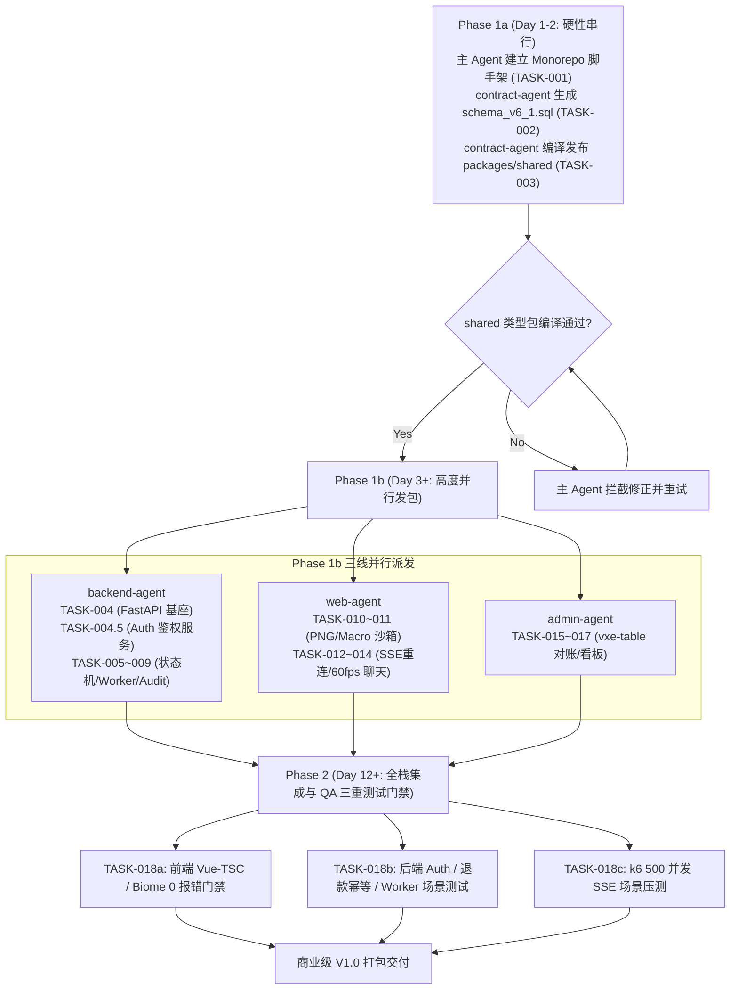

# 🏛️ TavernMobile (移动酒馆) 商业级全栈开发实施与 Agent 派发全景手册 (V7.1)

**项目名称**：TavernMobile (移动酒馆) 商业级全栈 SaaS 平台  
**总架构师**：主 Agent (Antigravity Senior Arch Agent)  
**文档目标**：结合技术负责人 2 的 5 大深度改进意见，升级全景手册为 V7.1 终极商业版，补齐 Auth 鉴权、`ApiResponse<T>` 统一契约、MSW Mock 桥与三段式 QA 测试场景  
**更新日期**：2026-08-10  

---

## 1. 商业项目总架构与派发原则 (Executive Summary)

本工程为商业级 AI 角色扮演 SaaS 平台，采用 **`pnpm Workspaces` 搭建 Monorepo 体系**，划分为 **移动端主应用 (`apps/web`)**、**运营管理后台 (`apps/admin`)**、**共享协议包 (`packages/shared`)** 与 **FastAPI 高并发异步后端 (`backend/`)** 4 大核心工程块。

为了防范 AI Agent 协同中的 **接口断层、Git 代码冲突与假完成** 隐患，严格遵循大厂 **“主控架构师 + 契约先行 + 隔离派发 + 测试门禁”** 5 大工程范式。

```
[TavernMobile 商业级 Monorepo 隔离架构]
├── 📁 apps/
│   ├── 📱 web/   (移动端 PWA - Vue 3.6 + Vite 6 + Vant 4 + UnoCSS) -> [由 web-agent 负责]
│   └── 🛠️ admin/ (运营管理后台 - Vue 3.6 + Vite 6 + vxe-table + Element Plus) -> [由 admin-agent 负责]
├── 📁 packages/
│   └── 📦 shared/ (共享 TS 类型、ApiResponse 统一契约与 MSW Mock 桥) -> [由 contract-agent 与 主 Agent 建立]
└── 📁 backend/ (FastAPI 异步高并发后端 - Python 3.12+/3.13 + PG 16/17) -> [由 backend-agent 负责]
```

---

## 2. 主 Agent vs 子 Agent 职责划归矩阵 (Master vs Subagent Matrix)

| Agent 角色 | 身份与定位 | 允许写入的工程目录 | 核心职责与操作越界红线 |
| :--- | :--- | :--- | :--- |
| **主 Agent** (总架构师/我们) | 商业项目总指挥与质量门禁官 | 根目录配置文件、`docs/` 及全栈验收 | 1. 制定架构规范、数据库 Schema 与全局配置。<br>2. 调用派发与调度子 Agent。<br>3. 执行写后自动化构建与集成门禁。<br>4. 严禁子 Agent 越权修改非专有目录。 |
| **`contract-agent`** (契约 Agent) | 数据库与接口契约专家 | `packages/shared/`, `docs/sql/` | 1. 建立 `schema_v6_1.sql` 数据库全量 Schema。<br>2. 建立 `packages/shared` 中的共享 TS 类型、`ApiResponse<T>` 契约与 MSW Mock 桥。 |
| **`backend-agent`** (后端 Agent) | 高并发 LLM 网关与状态机专家 | `backend/` | 1. 实现用户 Auth 鉴权服务 (`/login`, `/register`, JWT)。<br>2. 编写 FastAPI `uvloop` 预冻结划扣状态机。<br>3. C 扩展 `regex` 线程池解耦与 PG `SKIP LOCKED` 队列。 |
| **`web-agent`** (移动端 Agent) | Vue 3.6 PWA 极速前端专家 | `apps/web/` | 1. 极简/专家双轨模式 ChatView 编写。<br>2. `vue-virtual-scroller` 动态高度与 Swipe 60fps 防抖。<br>3. PNG 隐写 Worker 与 Macro 隔离沙箱。 |
| **`admin-agent`** (管理后台 Agent)| 桌面端 `vxe-table` 高阶控制台专家 | `apps/admin/` | 1. 基于 `vxe-table` (v4.7+) 编写万级数据对账与 API Key 表格。<br>2. ECharts 商业算力 GMV 仪表盘与 DMCA 下架。 |
| **`qa-agent`** (测试门禁 Agent) | 自动化质量与并发压测专家 | `backend/tests/`, 根目录 | 1. 运行 Biome 校验与 Vue-TSC 类型检查 (TASK-018a)。<br>2. 运行 JWT、断流退款幂等性与 Worker 重启断言测试 (TASK-018b)。<br>3. 使用 `k6` 进行 500 并发 SSE 流式压测 (TASK-018c)。 |

---

## 3. 锁步开发时间排期 (Lock-Step Timeline)



---

## 4. 原子化 Task 任务卡清单 (TASK-001 ~ TASK-018c)

### 阶段 1：契约先行与工程基座 (Phase 1a)

#### 📌 TASK-001：Monorepo 工程基座与依赖锁配置
- **执行角色**：主 Agent (总架构师)
- **目标路径**：根目录 `package.json`, `pnpm-workspace.yaml`
- **主要职责**：配置 `pnpm.overrides` 强制锁定 `"vue": "3.6.0"`。
- **验收断言**：`pnpm install` 成功，无版本冲突。

#### 📌 TASK-002：全栈数据库 Schema (`schema_v6_1.sql`) 编写
- **执行角色**：`contract-agent`
- **目标路径**：`docs/sql/schema_v6_1.sql`
- **主要职责**：
  1. `chat_messages` 表显式添加 **`USING GIN (ancestor_path)`** 倒排索引。
  2. `settlement_jobs` 表配置 `autovacuum_vacuum_scale_factor = 0.05`。
  3. `admin_audit_logs` 表配置 `trg_protect_audit_logs` 触发器与 `REVOKE UPDATE, DELETE` 账号层强约束。
- **验收断言**：SQL 脚本无语法错误，索引与触发器完整。

#### 📌 TASK-003：`packages/shared` 共享 TS 类型、`ApiResponse<T>` 契约与 MSW Mock 桥
- **执行角色**：`contract-agent`
- **目标路径**：`packages/shared/src/types/`, `packages/shared/src/mocks/`
- **主要职责**：
  1. 导出 `ChatNode`、`UserSession`、`CreditLog`、`AdminAuditLog` 等共享 TS 类型。
  2. **[新增]** 导出统一 `ApiResponse<T>`（结构：`{ code: number, data: T, message: string, timestamp: number }`）与 `ApiErrorEnvelope`。
  3. **[新增]** 提供 Mock Service Worker (MSW) 基础 Handler 模组，为前端并行自测提供支持。
- **验收断言**：`pnpm --filter @tavern/shared build` 0 类型错误编译通过。

---

### 阶段 2：后端高并发 LLM 网关与划扣引擎 (Phase 1b - `backend-agent`)

#### 📌 TASK-004：FastAPI 后端脚手架与 PostgreSQL / Redis 连接池
- **执行角色**：`backend-agent`
- **目标路径**：`backend/src/core/`, `backend/src/db/`
- **主要职责**：配置 Python 3.12+ `uvloop` 事件循环、SQLAlchemy 2.0 Async 与 asyncpg / redis 连接池。
- **验收断言**：`pytest backend/tests/unit/test_db_conn.py` 100% 通过。

#### 📌 TASK-004.5：[新增] 用户注册/登录与 JWT 双 Token 鉴权服务
- **执行角色**：`backend-agent`
- **目标路径**：`backend/src/api/v1/auth/`
- **主要职责**：
  1. 实现 `/api/v1/user/auth/register` 与 `/login` 接口，使用 passlib / bcrypt 进行密码哈希。
  2. 实现 JWT Access Token (15分钟) 与 Refresh Token (7天) 双 Token 签发与自动刷新机制。
  3. 编写用户 Auth 中间件 `user_auth_middleware.py` 保护受鉴权路由。
- **验收断言**：`pytest backend/tests/unit/test_auth_service.py` 测试通过，支持并发刷新 Token。

#### 📌 TASK-005：SSE 流式预冻结划扣状态机 (`state_machine_gateway.py`)
- **执行角色**：`backend-agent`
- **目标路径**：`backend/src/gateway/state_machine_gateway.py`
- **主要职责**：实现 `PRE_AUTH` $\rightarrow$ `STREAMING` $\rightarrow$ `SETTLEMENT` 三阶段状态机与 `request_id` 幂等锁。
- **验收断言**：断流与重复划扣并发测试无一退款失败。

#### 📌 TASK-006：动态优先级 Token 压栈算法 (`priority_sliding_budget.py`)
- **执行角色**：`backend-agent`
- **目标路径**：`backend/src/gateway/priority_sliding_budget.py`
- **主要职责**：实现 P0 人设 $\rightarrow$ P1 Lorebook $\rightarrow$ P2 历史倒序滑动压栈。
- **验收断言**：1000 轮历史对话压栈拼装总耗时 $< 2ms$。

#### 📌 TASK-007：C 扩展正则解耦与 SSE Raw Bytes 零拷贝管道
- **执行角色**：`backend-agent`
- **目标路径**：`backend/src/services/stream_regex_service.py`
- **主要职责**：C 扩展 `regex` 抛入线程池解耦 GIL；SSE 管道 `Raw Bytes` / `orjson` 零拷贝透传。
- **验收断言**：高并发下 `uvloop` 事件延迟 $< 5ms$。

#### 📌 TASK-008：PostgreSQL `SKIP LOCKED` 资金事务扫尾 Worker
- **执行角色**：`backend-agent`
- **目标路径**：`backend/src/workers/settlement_sweep_worker.py`
- **主要职责**：基于 `SKIP LOCKED` 实现 Worker 抢占划扣扫尾与死信落盘 (`DEAD_LETTER`)。
- **验收断言**：模拟 Worker 重启，无死账无重复划扣。

#### 📌 TASK-009：Admin 子域名网络隔离与不可篡改审计中间件
- **执行角色**：`backend-agent`
- **目标路径**：`backend/src/api/v1/admin/`, `backend/src/api/middlewares/`
- **主要职责**：配置 `admin-api` 子域名、IP 白名单与 `admin_audit_logs` 审计落盘。
- **验收断言**：公网访问 `/admin/` 强制拦截，敏感操作 100% 审计落盘。

---

### 阶段 3：移动端 PWA 主应用开发 (Phase 1b - `web-agent`)

#### 📌 TASK-010：PNG 隐写 Worker 解析沙箱
- **执行角色**：`web-agent`
- **目标路径**：`apps/web/src/workers/png_sandbox_worker.js`
- **主要职责**：Worker 沙箱中解析 SillyTavern PNG V2/V3 `tEXt/iTXt` 节点。
- **验收断言**：主线程 0 卡顿，50+ 张测试卡片解析率 100%。

#### 📌 TASK-011：角色卡 Macro / JS 隔离解析容器 (`iframe sandbox`)
- **执行角色**：`web-agent`
- **目标路径**：`apps/web/src/components/sandbox/MacroSandboxContainer.vue`
- **主要职责**：`iframe sandbox` 容器解析 `{{getvar::x}}` 动态 Macro 变量。
- **验收断言**：恶意 `<script>` 脚本 100% 被隔离拦截。

#### 📌 TASK-012：SSE 增量重连与 IndexedDB 离线草稿暂存
- **执行角色**：`web-agent`
- **目标路径**：`apps/web/src/utils/sse_reconnect_manager.ts`
- **主要职责**：实现 `Last-Event-ID` 增量恢复机制与 Dexie.js 草稿暂存。
- **验收断言**：切后台 10s 切回自动恢复，草稿 0 丢失。

#### 📌 TASK-013：`vue-virtual-scroller` 动态高度与 Swipe 60fps 防抖
- **执行角色**：`web-agent`
- **目标路径**：`apps/web/src/components/chat/SwipeVirtualScroller.vue`
- **主要职责**：手势滑动 Transition 动画期间防抖 `ResizeObserver`，锁死 60fps。
- **验收断言**：200 轮长对话滑动无掉帧拉扯感。

#### 📌 TASK-014：极简/专家双轨模式对话主界面 (`ChatView.vue`)
- **执行角色**：`web-agent`
- **目标路径**：`apps/web/src/views/ChatView.vue`
- **主要职责**：集成 Vant 4 抽屉与 Radix Vue 极客面板，支持双轨一键平滑切换。
- **验收断言**：双轨界面切换顺畅，状态不丢失。

---

### 阶段 4：运营管理后台开发 (Phase 1b - `admin-agent`)

#### 📌 TASK-015：`vxe-table` 高性能 API Key 监控与熔断表格
- **执行角色**：`admin-agent`
- **目标路径**：`apps/admin/src/views/KeyManagerVxeTable.vue`
- **主要职责**：`vxe-table` 渲染 API Key 延时曲线与脱敏掩码，配置 `VXETable.config({ zIndex: 3000 })`。
- **验收断言**：万条表格滚动零卡顿，弹窗无遮挡。

#### 📌 TASK-016：`vxe-table` UGC 审核流水与 DMCA 批量下架面板
- **执行角色**：`admin-agent`
- **目标路径**：`apps/admin/src/views/AuditFlowVxeTable.vue`
- **主要职责**：`vxe-table` 待审核角色卡流，支持多选 DMCA 批量下架与 JSON Diff。
- **验收断言**：下架操作自动触发后端 `admin_audit_logs` 审计落盘。

#### 📌 TASK-017：ECharts 商业算力与 GMV 收益仪表盘
- **执行角色**：`admin-agent`
- **目标路径**：`apps/admin/src/views/AdminDashboard.vue`
- **主要职责**：ECharts 5.5 渲染算力消耗、Token 成本比率与收益看板。
- **验收断言**：看板数据 30s 自动刷新。

---

### 阶段 5 & 阶段 6：全栈集成与 QA 三重测试门禁 (Phase 2 - `qa-agent`)

#### 📌 TASK-018a：[细化] 前端 TypeScript 类型与代码风格门禁
- **执行角色**：`qa-agent`
- **主要职责**：在 `apps/web` 与 `apps/admin` 跑 `vue-tsc --noEmit` 与 `biome check`。
- **验收断言**：全栈 TS 类型错误 0 报错，Lint 检查 0 警告。

#### 📌 TASK-018b：[细化] 后端 Auth 鉴权、退款幂等与 Worker 重启场景测试
- **执行角色**：`qa-agent`
- **主要职责**：运行 `pytest backend/tests/` 场景用例：
  1. 测试用户登录 JWT 签发与过期刷新。
  2. 测试 `PRE_AUTH` 客户端主动断开 $\rightarrow$ 幂等退款。
  3. 测试 `settlement_jobs` Worker 崩溃重启后死信任务重新消费。
- **验收断言**：Backend 全部集成场景测试用例 100% PASS。

#### 📌 TASK-018c：[细化] `k6` 500 并发 SSE 流式场景压测
- **执行角色**：`qa-agent`
- **主要职责**：使用 `k6` 模拟 500 个并发连接建立 SSE 长连接，其中 30% 连接中途随机断开。
- **验收断言**：零悬挂锁、零多扣漏退、P99 延迟 $< 200ms$，生产 Bundle 打包无错成功。

---

## 5. 商业上线质量红线 (Production Quality Guardrails)

全体子 Agent 在编写代码时，必须强制遵守以下 **4 条不可逾越红线**：

1. **零类型容忍**：全栈 TypeScript 代码绝对严禁使用 `any` 强行逃避类型检查，`pnpm build` 必须 100% 干净无错通过。
2. **零阻碍流式**：网关处理 SSE 流式推送内，绝对禁止实例化 Pydantic 模型或执行同步 `re.sub` 正则。
3. **资金强一致性**：所有算力扣划与退费，必须附带 `request_id` 幂等单元测试，并通过 PG 事务死信队列兜底。
4. **工作区目录隔离**：子 Agent 修改文件不得超越派发指定的专有目录 (`apps/web`, `apps/admin`, `backend`)。

---

## 6. 总结与行动指令

全景手册已升级至 **V7.1 终极商业版**。

主 Agent（我们）即刻启动 **Phase 1a (TASK-001 ~ TASK-003)**，完成 Monorepo 基座、`schema_v6_1.sql` 与 `packages/shared` 类型/Mock 包编译！🚀
