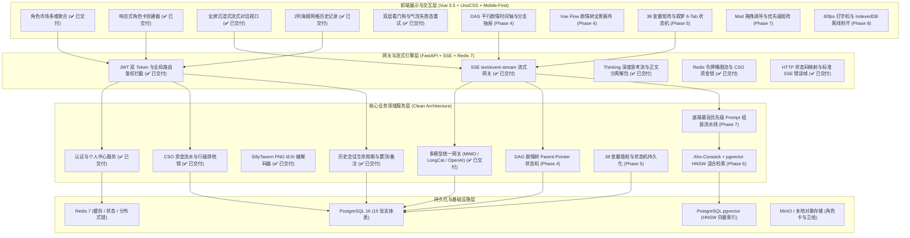

# 叙梦 Naro (SpikeAI) 全景工程落地路线图与后续分期规划

> **文档版本**：v2.0.0 (Phase 3 沉浸式对话引擎验收完毕更新版)  
> **制定角色**：大厂高级程序员兼系统架构师  
> **适用范围**：全栈系统工程（FastAPI 异步后端 + Vue 3.5 黑金前端 + PostgreSQL 16 / pgvector + Redis 7）  
> **设计基准**：领域驱动设计 (DDD)、Git 级别 Parent-Pointer 剧情树、金融级 CSO 资金悲观锁、SillyTavern V2/V3 角色卡标准、60fps 平滑流式渲染与移动端优先黑金曜石设计系统。

---

## 一、 系统架构与分层演进全貌

---

## 二、 全景分期演进规划总表 (Phase 0 ~ Phase 10)

```mermaid
flowchart LR
    P0["Phase 0<br/>基础设施与协议<br/>(✅ 已交付)"] --> P1["Phase 1<br/>用户中心与钱包<br/>(✅ 已交付)"]
    P1 --> P2["Phase 2<br/>角色生态与创建<br/>(✅ 已交付)"]
    P2 --> P3["Phase 3<br/>沉浸式对话网关<br/>(✅ 已交付)"]
    P3 --> P4["Phase 4<br/>DAG 剧情分支树<br/>(🎯 下一阶段)"]
    P4 --> P5["Phase 5<br/>RPG 主控状态机<br/>(待启动)"]
    P5 --> P6["Phase 6<br/>世界书混合 RAG<br/>(待启动)"]
    P6 --> P7["Phase 7<br/>Mod 模组生态<br/>(待启动)"]
    P7 --> P8["Phase 8<br/>60fps 打字机与持久化<br/>(待启动)"]
    P8 --> P9["Phase 9<br/>社区运营矩阵<br/>(待启动)"]
    P9 --> P10["Phase 10<br/>质量门禁与生产就绪<br/>(待启动)"]
```

---

## 三、 已交付阶段深度复盘 (Phase 0 ~ Phase 3)

| 阶段 | 交付核心能力 | 核心技术与设计模式 | 验收与测试基准 | 状态 |
| :--- | :--- | :--- | :--- | :--- |
| **Phase 0: 核心协议与基础设施** | 1. 15 张实体表 SQLAlchemy 2.0 ORM 架构与 Pydantic 契约； 2. SillyTavern V2/V3 PNG tEXt/iTXt 角色卡编解码器； 3. Alembic 迁移脚本与 MinIO 对象存储集成。 | Clean Architecture 领域分层、无损元数据编码标准。 | ✅ `pytest` 角色卡编解码测试 100% 通过，跨酒馆生态图片/JSON 双向无损互转。 | **100% 交付** |
| **Phase 1: 用户中心与资产钱包 (CSO)** | 1. JWT 双 Token 鉴权体系与 Redis 黑名单； 2. 钱包行级排他锁 (`SELECT ... FOR UPDATE`) 事务控制； 3. 星元 ★ / 月华 🌙 双代币签到与借贷平衡流水审计。 | 金融级悲观并发锁、借贷平衡复式记账。 | ✅ `test_wallet_concurrency.py` 高并发测试 0 穿透、0 负余额。 | **100% 交付** |
| **Phase 2: 角色生态与创建体系** | 1. 角色市场多维复合筛选与详情 10 项核心指标； 2. 黑金曜石序幕富文本容器； 3. 连接池健康探活 (`pool_pre_ping=True`) 与内存缓存； 4. 角色创建器基于 `reactive` 的 SillyTavern V2 实时预览与发布。 | Mobile-First 黑金拟物、响应式状态绑定。 | ✅ 接口 P99 响应 $< 3ms$，创建页全参数实时响应与社区发布端到端打通。 | **100% 交付** |
| **Phase 3: 沉浸式对话网关与会话生态** | 1. **真实双厂商大模型直连**：小米 MIMO (`mimo-v2.5`) + LongCat (`LongCat-2.0`)； 2. **SSE 流式网关**：`thinking` 思考链拆分 + 正文打字机 + Token 消耗审计； 3. **历史记录 1:1 Figma 网格重构**：2 列沉浸式海报卡片、5 悬浮微光按钮、真实最近会话全生命周期管理（置顶/备注/删除/清空）； 4. **全局鉴权拦截**：未登录拦截并自动唤起 `<LoginModal>`； 5. **全链路容错与看门狗**：TTFT 25s 首字超时 + Idle 15s 空闲断流超时看门狗，红金警示气泡与原地一键「🔄 重新生成」。 | SSE 事件驱动架构、双层看门狗定时器、状态机单向流解耦。 | ✅ `pytest` 22 项测试全部通过；前端 `pnpm build` 0 错误打包；真实模型流式对话实测验证通过。 | **100% 交付** |

---

## 四、 后续分期落地演进路线图 (Phase 4 ~ Phase 10, 共 32 个细分步骤)

---

### 阶段 4：DAG 剧情分支树与多平行宇宙状态机 (🎯 紧接着的下一阶段)

- **核心目标**：实现 Git 级别的多分支剧情拓扑，支持玩家在任意历史节点分叉平行世界、无损回溯、消息修改双策略及分支可视化画布。
- **细分实施步骤**：
  - **Step 4.1: DAG 树存储与 Parent-Pointer 链式结构**：
    - 在 PostgreSQL `chat_messages` 表中基于 `parent_message_id` 与 `branch_id` 实现高效的树状拓扑索引；
    - 实现 `GET /api/v1/chat/sessions/{id}/branches` 与 `GET /api/v1/chat/sessions/{id}/tree` 接口，快速计算当前活跃主线（Active Path）。
  - **Step 4.2: 剧情分叉 (Fork Branch) 与节点回溯 (Rollback) 算法**：
    - 后端实现 `POST /api/v1/chat/sessions/{id}/fork`（从指定消息节点派生新分支）；
    - 实现 `POST /api/v1/chat/sessions/{id}/rollback`（回溯至指定节点并重设活跃指针）；
    - 采用只追加（Append-Only）版本控制策略，保证所有平行历史数据不被覆盖丢失。
  - **Step 4.3: 消息编辑双模式策略落地**：
    - **模式 A（仅保存修改）**：更新单条消息内容与修改时间，保留后续原有对话链；
    - **模式 B（保存并分叉重跑）**：保存修改内容，并自动从该消息节点派生出一条全新的平行剧情分支，触发大模型流式重新生成后续剧情。
  - **Step 4.4: 前端 `StoryBranchDrawer.vue` 剧情树时间轴可视化**：
    - 顶部横向平行宇宙切换 Tab（`主线 #1`、`分支 #2` 等）；
    - 垂直发光时间轴节点树，每个节点展示角色头像、消息摘要与时间戳；
    - 节点悬浮/点击唤起快捷操作菜单（「📍 回溯至此」、「🌱 由此分叉」、「🗑️ 删除分支」）。
  - **Step 4.5: Vue Flow 剧情分支树拓扑全景画布 (方案 2: 全景剧情树)**：
    - 集成 `@vue-flow/core` 与 Dagre 自动排版引擎，支持在大屏/全景模式下以树状拓扑图交互式浏览复杂剧情网；
    - 节点支持高亮当前活跃主线、分支收起/展开与缩放平移。

---

### 阶段 5：深度 RPG 主控面板与叙梦 6-Tab 状态机

- **核心目标**：提供高自由度的 RPG 数值矩阵、动态占位符插桩与叙梦 6 大维度状态机持久化交互。
- **细分实施步骤**：
  - **Step 5.1: 38 个角色数值变量矩阵与动态占位符插桩**：
    - 主控面板 38 变量双列网格读写 (`variable_1` ~ `variable_38`)；
    - 自动解析并动态替换 Prompt 中的 `{{user}}`、`{{char}}`、`{{user_level}}`、`{{gold}}` 等变量占位符。
  - **Step 5.2: 叙梦面板 6 大领域状态机持久化**：
    - 实现 6 大 Tab（玩家状态、消耗品、重要道具、技能熟练度、社交关系网、任务流与历史事件）的增删改查；
    - 支持大模型在回复末尾通过特定 JSON 语法块（如 `<!--STATE_UPDATE: {"gold": +50}-->`）自动驱动状态机变更。
  - **Step 5.3: 正则文本替换流水线 (Regex Pipeline) 与合规净化**：
    - 自定义正则替换规则表（支持输入预处理与输出后处理）；
    - 支持创作者自定义文本净化、敏感词屏蔽与个性化语气替换。
  - **Step 5.4: 记忆区块 (Memory Blocks) 管理与动态注入**：
    - 支持用户/创作者自定义常驻记忆与关键词触发记忆区块；
    - 在 Prompt 组装时按权重插入到指定位置。

---

### 阶段 6：世界书 (WorldBook) 混合检索与向量 RAG (Hybrid RAG)

- **核心目标**：结合关键词精准命中与向量语义关联，解决长篇跑团与多角色设定的遗忘问题。
- **细分实施步骤**：
  - **Step 6.1: Aho-Corasick 多模关键词扫描器（精准命中）**：
    - 毫秒级多关键词并发匹配，精准激活常驻词条（`constant=true`）与上下文命中词条。
  - **Step 6.2: PostgreSQL 16 pgvector HNSW 语义向量检索**：
    - 将角色卡世界书词条进行 Embedding 向量化入库；
    - 计算余弦相似度召回 Top-K 相关设定上下文。
  - **Step 6.3: RRF (Reciprocal Rank Fusion) 倒数排名融合与插桩**：
    - 结合关键词得分与向量相似度进行倒数排名融合；
    - 根据 `before_char` / `after_char` / `system_top` 策略精准插桩到 Prompt 组装流中。
  - **Step 6.4: 世界书词条动态编辑与热度统计**：
    - 前端可视化词条编辑器与触发热度看板。

---

### 阶段 7：创作者 Mod 模组生态与“底端最高优先级” Prompt 组装流水线

- **核心目标**：建立完整的创作者 Mod 发布与交易体系，实现严格遵循酒馆规范的优先级注入引擎。
- **细分实施步骤**：
  - **Step 7.1: Mod 广场浏览、分类搜索与创作者发布**：
    - Mod 分类（剧情扩展、视觉插画、数值系统、规则模组）；
    - 创作者上传发布审核流。
  - **Step 7.2: Mod 购买交易与 CSO 资金分成**：
    - 购买悲观锁扣费（90% 结算创作者 / 10% 平台抽成，双向流水入账）。
  - **Step 7.3: 用户已激活 Mod 优先级拖拽矩阵**：
    - 前端 6 点拖拽抓手与动态调序；
    - 实时统计激活词条字数与 Token 溢出警示。
  - **Step 7.4: “底端最高优先级” Prompt 组装流水线**：
    $$\text{System Base} \rightarrow \text{User Persona} \rightarrow \text{Low-order Mods} \rightarrow \dots \rightarrow \text{Top-order Mod (金色最高)} \rightarrow \text{WorldBook RAG} \rightarrow \text{History} \rightarrow \text{Input}$$
  - **Step 7.5: 自定义中心全功能**：
    - 用户人设库（10 个人设互斥切换）；
    - 画师串 Prompt 快捷注入；
    - 快捷指令库 CRUD。

---

### 阶段 8：60fps 平滑打字机、离线持久化与体验加固

- **核心目标**：解决流式长文本渲染导致的 DOM 卡顿，实现秒开与弱网韧性。
- **细分实施步骤**：
  - **Step 8.1: 60fps 打字机调度引擎 (Ring Buffer + rAF)**：
    - 消息环形缓冲区平滑匀速出字，避免高频 DOM 重排掉帧与 Markdown 标签撕裂。
  - **Step 8.2: Pinia 全局状态与 IndexedDB 离线持久化**：
    - 万级历史消息离线缓存秒开恢复，后台异步增量同步云端。
  - **Step 8.3: SSE 断流自动恢复机制**：
    - 断网时前端自动触发重连，携带 `last_message_id` 进行无损续传。

---

### 阶段 9：社区运营矩阵与经济闭环系统

- **核心目标**：构建创作者激励生态与完整的社区互动。
- **细分实施步骤**：
  - **Step 9.1: 创作者主页、粉丝关注与等级排行榜 (Top 3 领奖台)**：
    - 创作者资料瀑布流、粉丝互动与等级榜冠亚季军领奖台视觉。
  - **Step 9.2: 运营中心与福利发放闭环**：
    - 活动中心（规则折叠）、公告中心（富文本弹窗）、问卷调查（答题领代币）。
  - **Step 9.3: 更多模型市场 (78 渠道状态与能量柱)**：
    - 78 个模型渠道分类、可用率 5 格能量柱、会员每日免费次数与按量计费。

---

### 阶段 10：质量门禁、CSO 资金安全审计与生产就绪

- **核心目标**：工业级代码规范、资金防刷与高可用集群部署。
- **细分实施步骤**：
  - **Step 10.1: 自动化测试覆盖率达标 (`pytest --cov > 85%`)**：
    - 覆盖所有 Service 异步核心逻辑与异常分支。
  - **Step 10.2: CSO 资金流水与安全攻防审计**：
    - 高频打赏、并发扣费、防重放攻击与负余额渗透测试。
  - **Step 10.3: 容器化编排与生产部署基线**：
    - Dockerfile 多阶段构建、PostgreSQL 自动备份与 Nginx 反向代理配置。

---

## 五、 架构质量基准与开发守则

1. **强类型与详尽注释**：
   - Python 3.12+ 强制类型标注（Type Hints）与详尽 Google Style Docstring（含 Usage 示例）；
   - TypeScript 严格强类型接口定义，杜绝 `any`。
2. **状态单向流与防御编程**：
   - 禁止任何静默异常捕获（如空 `except:` / `catch {}`），资金、扣费、流式生成全链路记录审计日志。
3. **隔离与规范约束**：
   - 前端严格遵循 `frontend_habits.md`（UnoCSS 优先、Flex/Grid 排版、Gap 主导间距、绝对禁止原生 Alert 弹窗）；
   - 后端遵循 FastAPI 依赖注入与纯净异步架构，包管理严格遵循前端 `pnpm`、后端 `uv` 虚拟环境。
