# 叙梦 Naro (SpikeAI) 全景工程落地路线图与后续分期规划

> **文档版本**：v3.0.0 (Phase 4 DAG 剧情分支树与多平行宇宙状态机验收完毕版)  
> **制定角色**：SpikeAI 全栈架构师兼核心系统专家  
> **适用范围**：全栈系统工程（FastAPI 异步后端 + Vue 3.5 黑金前端 + PostgreSQL 16 / pgvector + Redis 7 + Vue Flow）  
> **设计基准**：领域驱动设计 (DDD)、Git 级别 Parent-Pointer 剧情树、金融级 CSO 资金悲观锁、SillyTavern V2/V3 角色卡标准、60fps 平滑流式渲染与移动端优先黑金曜石设计系统。

---

## 一、 系统架构与分层演进全貌

```mermaid
graph TB
    subgraph Client_Layer ["前端展示与交互层 (Vue 3.5 + UnoCSS + Mobile-First)"]
        UI_Home["角色市场多维聚合 (✅ 已交付)"]
        UI_Create["响应式角色卡创建器 (✅ 已交付)"]
        UI_Chat["全屏沉浸式流式对话视口 (✅ 已交付)"]
        UI_History["2列海报网格历史记录 (✅ 已交付)"]
        UI_Watchdog["双层看门狗与气泡失败态重试 (✅ 已交付)"]
        UI_Tree["倒序剧情时间轴与分支抽屉 (✅ 已交付 Phase 4)"]
        UI_Flow["自顶向下 Vue Flow 全景拓扑画布 (✅ 已交付 Phase 4)"]
        UI_Fork["单角色多历史记录独立派生 (✅ 已交付 Phase 4)"]
        UI_State["38 变量矩阵与叙梦 6-Tab 状态机 (🎯 Phase 5)"]
        UI_RAG["世界书 RAG 词条自动高亮与探索抽屉 (Phase 6)"]
        UI_Mod["Mod 拖拽调序与优先级矩阵 (Phase 7)"]
        UI_60fps["60fps 打字机与 IndexedDB 离线秒开 (Phase 8)"]
    end

    subgraph Gateway_Layer ["网关与流式引擎层 (FastAPI + SSE + Redis 7)"]
        GW_Auth["JWT 双 Token 与全局路由鉴权拦截 (✅ 已交付)"]
        GW_SSE["SSE text/event-stream 流式网关 (✅ 已交付)"]
        GW_Thinking["Thinking 深度思考流与正文分离解包 (✅ 已交付)"]
        GW_RateLimit["Redis 令牌桶限流与 CSO 资金锁 (✅ 已交付)"]
        GW_Error["HTTP 状态码映射与标准 SSE 错误帧 (✅ 已交付)"]
        GW_Fork["独立会话克隆与分支状态机端点 (✅ 已交付 Phase 4)"]
    end

    subgraph Domain_Core ["核心业务领域服务层 (Clean Architecture)"]
        SVC_Auth["认证与个人中心服务 (✅ 已交付)"]
        SVC_Wallet["CSO 资金流水与行级排他锁 (✅ 已交付)"]
        SVC_Card["SillyTavern PNG tEXt 编解码器 (✅ 已交付)"]
        SVC_LLM["多模型统一网关 (MIMO / LongCat / OpenAI) (✅ 已交付)"]
        SVC_History["历史会话生命周期与置顶/备注 (✅ 已交付)"]
        SVC_Tree["DAG 剧情树 Parent-Pointer 状态机 (✅ 已交付 Phase 4)"]
        SVC_Fork["独立会话深度克隆与消息链路回溯 (✅ 已交付 Phase 4)"]
        SVC_RPG["38 变量插桩与状态机持久化 (🎯 Phase 5)"]
        SVC_RAG["Aho-Corasick + pgvector HNSW 混合检索 (Phase 6)"]
        SVC_Prompt["底端最高优先级 Prompt 组装流水线 (Phase 7)"]
    end

    subgraph Storage_Layer ["持久化与基础设施层"]
        PG_DB["PostgreSQL 16 (15 张实体表)"]
        PG_Vector["PostgreSQL pgvector (HNSW 向量索引)"]
        Redis_DB["Redis 7 (缓存 / 状态 / 分布式锁)"]
        MinIO_S3["MinIO / 本地对象存储 (角色卡与立绘)"]
    end

    UI_Home --> GW_Auth
    UI_Create --> GW_Auth
    UI_Chat --> GW_SSE
    UI_History --> GW_Auth
    UI_Tree --> GW_SSE
    UI_Flow --> GW_SSE
    UI_State --> GW_SSE

    GW_Auth --> SVC_Auth
    GW_Auth --> SVC_Wallet
    GW_Auth --> SVC_History
    GW_SSE --> SVC_LLM
    GW_SSE --> SVC_Tree
    GW_SSE --> SVC_Fork
    GW_SSE --> SVC_Prompt

    SVC_Prompt --> SVC_RAG
    SVC_LLM --> PG_DB
    SVC_History --> PG_DB
    SVC_Tree --> PG_DB
    SVC_Fork --> PG_DB
    SVC_RPG --> PG_DB
    SVC_RAG --> PG_Vector
    SVC_Wallet --> PG_DB
    SVC_Auth --> Redis_DB
```

---

## 二、 全景分期演进状态矩阵 (Phase 0 ~ Phase 10)

```mermaid
flowchart LR
    P0["Phase 0<br/>基础设施与协议<br/>(✅ 已交付)"] --> P1["Phase 1<br/>用户中心与钱包<br/>(✅ 已交付)"]
    P1 --> P2["Phase 2<br/>角色生态与创建<br/>(✅ 已交付)"]
    P2 --> P3["Phase 3<br/>沉浸式对话网关<br/>(✅ 已交付)"]
    P3 --> P4["Phase 4<br/>DAG 剧情分支与独立会话<br/>(✅ 已交付)"]
    P4 --> P5["Phase 5<br/>RPG 主控与叙梦状态机<br/>(🎯 下一阶段)"]
    P5 --> P6["Phase 6<br/>世界书混合 RAG<br/>(待启动)"]
    P6 --> P7["Phase 7<br/>Mod 模组生态<br/>(待启动)"]
    P7 --> P8["Phase 8<br/>60fps 打字机与持久化<br/>(待启动)"]
    P8 --> P9["Phase 9<br/>社区运营与创作者激励<br/>(待启动)"]
    P9 --> P10["Phase 10<br/>质量门禁与生产就绪<br/>(待启动)"]
```

---

## 三、 已交付阶段复盘与技术成果 (Phase 0 ~ Phase 4)

| 阶段 | 交付核心能力 | 核心技术与设计模式 | 验收与测试基准 | 交付状态 |
| :--- | :--- | :--- | :--- | :--- |
| **Phase 0** | 前后端工程脚手架与规范初始化 | FastAPI + SQLAlchemy 2.0 Async + Vue 3.5 + UnoCSS + Biome + uv 虚拟环境 | 前后端基础联调通过 | ✅ **100% 交付** |
| **Phase 1** | 用户认证鉴权与 CSO 钱包计费流水 | JWT 双 Token 无感刷新、`with_for_update` 行级悲观锁、钱包流水审计、充值提现 | 自动化单测 100% 通过、余额一致性校验通过 | ✅ **100% 交付** |
| **Phase 2** | 角色生态系统与 SillyTavern 编解码 | PNG tEXt/iTXt 无损编解码、角色市场多维排序、1:1 高保真创建器、发布/草稿流 | 单测 100% 通过、ST 卡无损双向导入导出 | ✅ **100% 交付** |
| **Phase 3** | 沉浸式流式对话网关与双层看门狗 | Xiaomi MIMO & LongCat 多模型网关、SSE 打字机流、Thinking 思维链解包、25s TTFT + 15s Idle 看门狗、气泡失败态原地重试、2列海报网格历史记录 | 单测 100% 通过、真实多模型流式联调通过 | ✅ **100% 交付** |
| **Phase 4** | DAG 剧情分支树、独立会话派生与自顶向下拓扑画布 | Parent-Pointer 剧情树、从任意 AI 节点深度克隆独立会话、倒序时间线抽屉（最新在顶部）、Top-to-Bottom 垂直 Vue Flow 画布、消息原位修改与改写重跑 | `uv run pytest` 23/23 100% 通过、`pnpm build` 0 错误、真机截图回归 | ✅ **100% 交付** |

---

## 四、 后续分期规划与技术契约 (Phase 5 ~ Phase 10)

### 🎯 Phase 5: RPG 主控面板 38 变量矩阵与叙梦 6 大 Tab 状态机持久化

> **核心目标**：实现角色扮演中极高自由度的数值插桩、状态同步与叙梦 6 大子面板的实时双向绑定。

#### 1. 后端工程（Scope: `backend/`）
- **数据表与模型**：
  - `chat_control_panels`：维护 `user_name`、`user_persona`、`custom_prompt`、`variables` (JSONB `variable_1` ~ `variable_38` 矩阵)、`memory_blocks` (手动记忆)、`text_replacements` (正则替换链)；
  - `chat_narrative_states`：维护 6 大 Tab 状态机 (`date_text`、`time_text`、`location`、`present_characters`、`player_states`、`consumables`、`important_items`、`skills`、`social_relations`、`tasks`、`history_events`)；
- **Prompt 插桩管道**：
  - 将 38 变量与叙梦状态机序列化注入 System Prompt，大模型回复后支持正则/JSON 提取更新状态；
- **API 路由**：
  - `GET /api/v1/chat/sessions/{session_id}/control-panel` & `PUT /api/v1/chat/sessions/{session_id}/control-panel`
  - `GET /api/v1/chat/sessions/{session_id}/narrative-state` & `PUT /api/v1/chat/sessions/{session_id}/narrative-state`

#### 2. 前端工程（Scope: `frontend/`）
- **主控抽屉与叙梦抽屉**：
  - 激活 [`ControlPanelDrawer.vue`](file:///d:/AI/spikeai/frontend/src/views/chat/components/ControlPanelDrawer.vue) 与 [`NarrativePanelDrawer.vue`](file:///d:/AI/spikeai/frontend/src/views/chat/components/NarrativePanelDrawer.vue) 的真实后端数据双向同步；
  - 38 变量矩阵输入联动，背包物品增删、NPC 关系四宫格增减与星期分组事件轴展示。

---

### 📖 Phase 6: 世界书 (World Book) Aho-Corasick + pgvector HNSW 语义混合 RAG 召回

> **核心目标**：实现毫秒级世界书词条命中与向量语义深度召回，让超大世界观与多角色设定精准触发。

#### 1. 后端工程（Scope: `backend/`）
- **双模召回引擎**：
  - **精准命中**：基于 `ahocorasick` C 扩展算法在 <1ms 内扫描用户输入与历史消息命中关键字；
  - **语义扩展**：基于 PostgreSQL `pgvector` HNSW 向量索引召回相似度 Top-K 词条；
  - **去重与预算控制**：根据 Token 上限（如 2000 Tokens）动态截断并按权重插入上下文。

---

### 🧩 Phase 7: Mod 模组中心与合集/Mod设置联动生态

> **核心目标**：将 1:1 Figma 原型中已构建的 Mod 广场、我创作的 Mod、我购买的 Mod、合集管理与 Mod 优先级拖拽调序全部联动真实后端。

#### 1. 业务功能矩阵
- **Mod 广场浏览与购买**：消耗星元/月华购买社区热门 Mod（如战斗数值模组、催眠指令模组）；
- **Mod 优先级排序与合并**：多 Mod 激活时，按用户在前端拖拽设置的优先级顺序合并 Prompt 指令；
- **Mod 合集一键装配**：一键应用整套 Mod 预设合集。

---

### ⚡ Phase 8: 60fps 平滑打字机、离线持久化与多端同步

> **核心目标**：极速响应与极致性能优化。

- **`requestAnimationFrame` 打字机缓冲调度**：平滑分批吐字，彻底杜绝超长 Markdown 渲染卡顿；
- **IndexedDB 异步本地快照**：历史消息秒开加载，支持离线查看；
- **云端备份同步**：一键将本地自定义指令、画师串与人设打包备份至云端。

---

### 💎 Phase 9: 社区创作者经济生态、分成激励与钱包提现

> **核心目标**：创作者商业闭环与激励发放。

- **创作者收益分成结算**：用户游玩/购买付费角色卡与 Mod 时，按比例实时结算至创作者钱包；
- **每日收益领取与提现申请**：支持收益一键入账与流水审计；
- **社区精选榜与热度算法**：按互动量、收藏量、打赏量自动计算热度分。

---

### 🛡️ Phase 10: 生产就绪、全链路压测与质量门禁

> **核心目标**：企业级高可用与合规保障。

- **自动化全量回归测试**：后端 `pytest` + 前端 `vitest` + `playwright` 端到端回归；
- **敏感词过滤与内容安全合规**：接入敏感词过滤字典与合规检测网关；
- **Docker Compose 一键容器化部署**：包含 PostgreSQL、Redis、FastAPI、Vite 前端 Nginx 编排。
