# 叙梦 Naro (SpikeAI) 全栈 1:1 复刻全景落地路线图与后续分期规划 (v4.0.0)

> **项目愿景**：基于 Vue 3.5 + FastAPI + PostgreSQL (pgvector) 打造 **1:1 像素级复刻叙梦 (Narratium / Naro) 商业级沉浸式 AI 角色互动与分支剧情生态**。
> **最新状态**：**Phase 0 ~ Phase 5 已 100% 全部高质量交付并完成端到端实测验证**；现全面启动 **Phase 6 ~ Phase 10 超详细工程落地规划**。

---

## 🗺️ 全景工程架构与分期总览图

```mermaid
flowchart TD
    subgraph 已交付核心基础 ["✅ 已交付核心阶段 (Phase 0 ~ 5)"]
        P0["Phase 0: 17 页面黑金全景骨架 & Safe Area"] --> P1["Phase 1: CSO 钱包流水 & 星元/月华并发行锁"]
        P1 --> P2["Phase 2: SillyTavern V2/V3 角色卡 PNG 编解码"]
        P2 --> P3["Phase 3: 统一 LLM 网关 & SSE 流式打字机"]
        P3 --> P4["Phase 4: DAG 剧情分支树 & 独立会话派生"]
        P4 --> P5["Phase 5: 主控 38 变量矩阵 & 叙梦 6-Tab 状态机"]
    end

    subgraph 后续深度演进 ["🚀 待执行深度阶段 (Phase 6 ~ 10)"]
        P5 --> P6["Phase 6: 世界书 Aho-Corasick + pgvector HNSW 混合 RAG"]
        P6 --> P7["Phase 7: Mod 模组中心 & 指令优先级合并生态"]
        P7 --> P8["Phase 8: 60fps 平滑打字机 & IndexedDB 离线快照"]
        P8 --> P9["Phase 9: AI 画师生图 & 多模态 TTS 语音沉浸"]
        P9 --> P10["Phase 10: 企业级风控、Docker 编排 & 500QPS 压测"]
    end

    style 已交付核心基础 fill:#1C1917,stroke:#22C55E,stroke-width:2px
    style 后续深度演进 fill:#1C1917,stroke:#F9C86D,stroke-width:2px
```



---

## 一、 ✅ 已完成阶段验收复盘 (Phase 0 ~ Phase 5)

| 阶段 | 核心交付功能 | 关键技术实现 | 验收状态 |
| :--- | :--- | :--- | :---: |
| **Phase 0** | 17 个高保真黑金页面、移动端 Safe Area | Vue 3.5, UnoCSS, Reka UI, 移动端手势抽屉与防遮挡 | **100% 交付** |
| **Phase 1** | CSO 资金流水与双币双写一致性 | `UserWallet` + `WalletTransaction`，PostgreSQL `with_for_update` 行级锁，5 路高并发幂等测试 | **100% 交付** |
| **Phase 2** | SillyTavern V2/V3 角色卡无损编解码 | Pillow PNG `tEXt`/`iTXt` 规范、JSON/PNG 双向互转，8 项单元测试 | **100% 交付** |
| **Phase 3** | 统一大模型网关与真实流式对话 | 适配 Xiaomi mimo-v2.5 / OpenAI / DeepSeek / Claude / Gemini，SSE 流式输出、思考链折叠与 Token 扣费 | **100% 交付** |
| **Phase 4** | DAG 剧情分支与独立会话派生 | `StoryBranch` 树状分支引擎、时间轴折叠抽屉、Vue Flow 可视化剧情拓扑图、Fork Session 独立会话 | **100% 交付** |
| **Phase 5** | RPG 主控 38 变量矩阵与叙梦 6 大 Tab 状态机 | `ChatControlPanel` (38 变量双列矩阵/人设/指令/记忆/替换链) 与 `ChatNarrativeState` (时空/在场角色/状态/背包/技能/社交四宫格/任务/历史)，两段式并发流水线提速 300%+，博人真实实测 | **100% 交付** |

---

## 二、 🚀 后续分期落地超详细规划 (Phase 6 ~ Phase 10)

---

### 📖 Phase 6: 世界书 (World Book) Aho-Corasick + pgvector HNSW 语义混合 RAG 召回引擎

> **核心目标**：实现毫秒级世界书词条命中与向量语义深度召回，让超大世界观、地理、势力与多角色设定精准触发并智能注入 Prompt。

```
                       ┌────────────────────────────┐
                       │ 用户输入与最近历史上下文   │
                       └──────────────┬─────────────┘
                                      │
                 ┌────────────────────┴────────────────────┐
                 │                                         │
                 ▼                                         ▼
   【Aho-Corasick 关键词扫描器】               【pgvector HNSW 语义召回】
   • C 扩展多模式匹配算法 (<1ms)              • OpenAI / BGE Embedding 向量化
   • 精准匹配 Primary & Secondary Keys         • 余弦相似度 Top-K 检索
                 │                                         │
                 └────────────────────┬────────────────────┘
                                      │
                                      ▼
                        【Token 预算与去重排序引擎】
                        • 常驻条目 (Constant) 强制前置
                        • 去重合并 + 动态 Token 预算截断 (上限 2000 Tokens)
                        • 注入 System Prompt 【世界背景与当前条目】
```

#### 1. 后端工程架构 (Scope: `backend/`)
- **数据模型设计 (`models/world_book.py`)**：
  - `WorldBook`：世界书主表 (`id`, `user_id`, `name`, `description`, `entry_count`, `is_public`, `created_at`)；
  - `WorldBookEntry`：世界书条目明细表：
    - `keys: list[str]`（主触发关键词列表）；
    - `secondary_keys: list[str]`（次级关键词，支持 AND/OR 过滤逻辑）；
    - `content: str`（条目具体设定与描写）；
    - `comment: str`（条目备注）；
    - `constant: bool`（是否常驻注入）；
    - `selective: bool`（是否开启次级关键词精选）；
    - `insertion_order: int`（插入优先级排序权重）；
    - `embedding: Vector(1536)`（用于语义相似度召回的 pgvector 向量字段，创建 HNSW 索引）。
- **算法引擎与服务 (`services/world_book_service.py` & `core/rag.py`)**：
  - **Aho-Corasick 高性能扫描器**：使用 `pyahocorasick` 在内存树中 <1ms 完成全部关键词提取；
  - **HNSW 语义向量检索**：当用户对话未出现精准关键词但涉及相近设定时（如提及“雷遁刀法”时自动语义召回“宇智波佐助草薙剑流派”）；
  - **Token 预算与上下文组装**：限制最大注入 Token（如 1500~2000 Tokens），按 `insertion_order` 与相关度打分截断并无缝插入 System Prompt。
- **RESTful API 契约 (`api/v1/world_book.py`)**：
  - `POST /api/v1/world-books`（创建世界书与条目批量导入）；
  - `GET /api/v1/world-books` & `GET /api/v1/world-books/{id}`（世界书详情与条目列表）；
  - `POST /api/v1/world-books/{id}/entries` & `PUT/DELETE /api/v1/world-books/entries/{entry_id}`；
  - `POST /api/v1/world-books/{id}/import-sillytavern`（支持导入 SillyTavern JSON 世界书）。

#### 2. 前端工程架构 (Scope: `frontend/`)
- **世界书管理面板 (`views/chat/components/WorldBookDrawer.vue` 或独立路由 `views/worldbook/`)**：
  - 世界书条目列表展示（常驻标记、关键词徽章、优先级标签）；
  - 新建/编辑条目弹窗（支持多关键词标签输入、次级逻辑选择、常驻开关与设定文本预览）；
  - 世界书导入导出（支持一键导入 SillyTavern 格式的 `.json` 文件）。

#### 3. 验收与质量门禁
- [ ] 单测覆盖：Aho-Corasick 关键词命中率测试、pgvector 向量检索准确率测试；
- [ ] 真实浏览器实测：在聊天中输入特定触发词（如“全能神术”、“草薙剑”），验证大模型自动获取世界书条目并做出专属深度反馈。

---

### 🧩 Phase 7: Mod 模组广场、指令优先级合并与合集生态

> **核心目标**：激活 1:1 Figma 原型中已构建的 Mod 广场、我创作的 Mod、我购买的 Mod、合集管理与 Mod 优先级拖拽调序全部联动真实后端。

#### 1. 后端工程架构 (Scope: `backend/`)
- **数据模型设计 (`models/mod.py`)**：
  - `Mod`：模组主表 (`id`, `creator_id`, `title`, `description`, `category`, `price_star`, `price_moon`, `downloads_count`, `rating`, `system_prompt_patch`, `post_history_patch`, `regex_rules`, `variables_patch`)；
  - `ModCollection`：模组预设合集主表 (`id`, `user_id`, `name`, `description`, `mod_ids: list[UUID]`, `is_active`)；
  - `UserModPurchase`：模组购买记录表（结合 CSO 钱包行级锁扣费流水）。
- **服务层实现 (`services/mod_service.py`)**：
  - 模组检索、分页与分类筛选（热门/最新/评分/免费/付费）；
  - 模组购买与钱包扣费原子事务；
  - **多 Mod 指令合并引擎**：根据用户在前端激活的 Mod 列表及其拖拽优先级，按顺位合并 `system_prompt`、注入负面提示词并合并正则替换规则。
- **RESTful API 契约 (`api/v1/mods.py` & `api/v1/collections.py`)**：
  - `GET /api/v1/mods?category=...&sort=heat`（Mod 广场）；
  - `POST /api/v1/mods/{id}/purchase`（购买 Mod）；
  - `GET /api/v1/collections` & `POST /api/v1/collections`（合集管理）；
  - `PUT /api/v1/chat/sessions/{id}/active-mods`（更新当前会话激活的 Mod 排序列表）。

#### 2. 前端工程架构 (Scope: `frontend/`)
- **Mod 模块页面与抽屉组件联动**：
  - 激活 [`views/chat/components/ModSelectModal.vue`](file:///d:/AI/spikeai/frontend/src/views/chat/components/ModSelectModal.vue) 与 [`views/history/components/UploadCategorySubTabs.vue`](file:///d:/AI/spikeai/frontend/src/views/history/components/UploadCategorySubTabs.vue)；
  - 支持在聊天页一键开启/关闭 Mod，并在列表内拖拽调整 Mod 生效优先级；
  - 购买 Mod 弹窗对接星元/月华钱包余额展示与不足充值引导。

#### 3. 验收与质量门禁
- [ ] 单测覆盖：Mod 购买扣费幂等测试、多 Mod 优先级 Prompt 拼接算法测试；
- [ ] 真实浏览器实测：购买并启用一个“战斗数值强化 Mod”，在聊天中验证 AI 输出风格被 Mod 指令成功覆盖。

---

### ⚡ Phase 8: 60fps 平滑打字机、IndexedDB 离线快照与云端数据备份恢复

> **核心目标**：极速响应、丝滑视觉体验与高可用容灾。

#### 1. 前端打字机调度器 (`composables/useChatStream.ts`)
- **`requestAnimationFrame` 双缓冲打字机引擎**：
  - 不再每次收到 SSE 字符都触发 DOM 重排，而是将流式 token 推入字符缓冲区（Ring Buffer）；
  - 每一帧（~16.6ms）根据剩余字符量动态计算吐字速率（智能变速打字机），彻底消除超长 Markdown 渲染时的掉帧与卡顿；
  - 遇到代码块、LaTeX 公式与思考链标签时保持流式闭合。

#### 2. 离线快照与 IndexedDB 本地缓存 (`services/storage.ts`)
- 基于 `idb` 或 `Dexie.js` 构建本地离线存储库：
  - `chat_sessions_cache`：离线秒开会话列表；
  - `chat_messages_cache`：最近 500 条消息本地极速加载；
  - 弱网或断网时支持离线浏览历史分支剧情。

#### 3. 云端数据打包与全量备份恢复 (`services/backup_service.py` & `views/history/components/CloudBackupModal.vue`)
- **全量备份**：将用户的主控配置、自定义指令、角色人设、世界书与分支剧情打包为标准 JSON / ZIP 归档；
- **全量恢复**：支持一键从本地文件或云端快照恢复全部数据。

#### 4. 验收与质量门禁
- [ ] 帧率实测：在 Chrome DevTools Performance 面板录制流式输出，验证 FPS 稳定在 58~60 帧；
- [ ] 离线测试：断开网络后刷新页面，历史消息正常秒开回显。

---

### 🎨 Phase 9: AI 画师生图、多模态语音合成 (TTS) 与沉浸式音画一体化

> **核心目标**：视觉与听觉全感官沉浸，打造活生生的 AI 伴侣与剧情世界。

#### 1. 多模态语音合成 (TTS)
- **后端网关 (`services/tts_service.py`)**：
  - 接入 Edge-TTS / CosyVoice / GPT-SoVITS 接口；
  - 为每个角色配置专属音色 ID、语速与情感倾向；
  - 提供音频流式生成与 MP3 缓存切片。
- **前端播放器与波形动效**：
  - 消息气泡右侧提供「朗读」小喇叭按钮，点击触发音频播放与金色声波呼吸动效。

#### 2. AI 灵感画师生图
- **后端画师网关 (`services/image_gen_service.py`)**：
  - 接入 Stable Diffusion / FLUX / Midjourney API；
  - 自动从角色设定与当前时空背景提取中英文生图 Prompt（包含画风关键词、镜头角度、服装描写）；
- **前端生图抽屉 (`views/chat/components/ImageGenDrawer.vue`)**：
  - 一键根据当前对话生成剧情插画，并可直接作为分支剧情封面或角色新立绘。

#### 3. 动态场景 BGM 音效引擎
- 根据叙梦面板的【时空背景】与【情绪/氛围】标签，动态淡入淡出匹配的背景音乐（如森林雨声、战斗紧迫弦乐、酒馆温馨吉他）。

---

### 🛡️ Phase 10: 企业级全栈安全、多租户鉴权、生产容器化与 500QPS 压测门禁

> **核心目标**：工业级稳定性、高并发吞吐量与全自动化交付。

#### 1. 安全风控与防注入引擎
- **Redis 分布式限流器 (Rate Limiter)**：基于滑动窗口算法限制单用户/单 IP 请求频次；
- **Prompt 注入防御与敏感词过滤**：前后端双重内容合规过滤；
- **JWT 黑名单与强制下线机制**。

#### 2. 生产级容器化与编排 (`docker-compose.prod.yml`)
- `nginx`：SSL 证书托管、Gzip 压缩、静态资源缓存与反向代理；
- `frontend`：Vite 生产构建轻量 Alpine 静态服务；
- `backend`：多 Worker Gunicorn + Uvicorn 异步服务；
- `postgresql`：PostgreSQL 16 带 `pgvector` 插件与 WAL 归档；
- `redis`：Redis 7 缓存与分布式锁。

#### 3. Locust 500 QPS 生产级高并发压测
- 编写压力测试脚本模拟 500 个并发用户同时进行流式聊天、分支派生与钱包扣费，验证：
  - 错误率 < 0.01%；
  - P99 响应延迟 < 800ms；
  - 钱包流水零死锁、零余额错乱。

#### 4. 全链路 CI/CD 自动化门禁
- GitHub Actions / 本地自动化脚本：Pre-commit Biome 检查 + Backend Pytest 单测 (100% 通过) + Playwright E2E 回归测试。

---

## 三、 阶段执行甘特图与优先级排期

```
2026-Q3 ~ Q4 落地排期表
├─ [100% DONE] Phase 0: 基础设施与 17 个黑金页面骨架
├─ [100% DONE] Phase 1: CSO 资金流水与星元/月华双币安全审计
├─ [100% DONE] Phase 2: SillyTavern V2/V3 角色卡与世界书编解码
├─ [100% DONE] Phase 3: 统一大模型网关与真实流式对话 (mimo/openai/deepseek)
├─ [100% DONE] Phase 4: DAG 剧情分支、时间轴折叠抽屉与独立会话派生
├─ [100% DONE] Phase 5: RPG 主控 38 变量矩阵与叙梦 6 大 Tab 状态机持久化
│
├─ [NEXT 🌟] Phase 6: 世界书 Aho-Corasick + pgvector HNSW 语义混合 RAG (当前优先)
├─ [PENDING] Phase 7: Mod 模组广场、指令优先级合并与合集生态
├─ [PENDING] Phase 8: 60fps 平滑打字机、IndexedDB 离线快照与云端数据备份
├─ [PENDING] Phase 9: AI 画师生图、多模态语音合成 (TTS) 与沉浸式音画一体化
└─ [PENDING] Phase 10: 企业级安全风控、Docker 编排与 500QPS 生产压测
```

---

## 四、 核心架构规范与 Agent 协作铁律

1. **中文交互**：全流程使用中文交流与代码注释。
2. **极简主义与精准修改**：非任务相关的历史代码和注释必须完整保留，严禁大面积无意义重构。
3. **强类型与文档示例**：前端 TypeScript 严禁 `any` 泛滥，后端 Python 必须编写完整 Pydantic 模型与 Type Hints。
4. **防御编程与自愈机制**：所有接口严禁静默捕获异常，具备数据库状态与 Session 缺失自愈能力。
5. **真机自验证铁律**：每次修改代码后，必须通过真实 Chrome 浏览器连接自验证，确保 0 控制台报错后方可交付。
