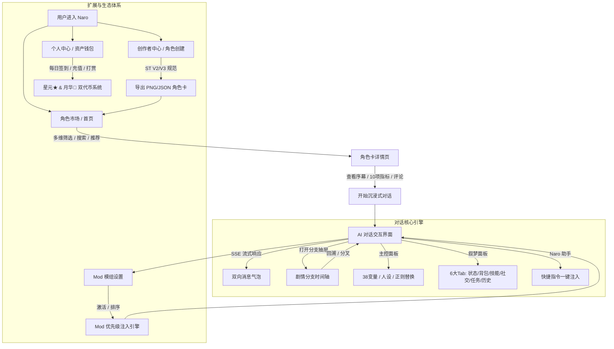

# 叙梦 Naro 全栈系统：全量产品功能规格说明书 (PRD)

> **版本**：v1.0.0  
> **状态**：正式发布 / 开发基准  
> **适用对象**：产品经理、前端开发工程师、后端开发工程师、QA 测试工程师  

---

## 一、 产品概述与定位

### 1.1 产品定义与核心价值
**叙梦 Naro** 是一款面向二次元、RPG 跑团、网文爱好者及深度角色扮演用户的 **1:1 沉浸式 AI 角色互动与分支剧情社区**。平台集成了角色市场、多宇宙剧情分支时间轴、深度 RPG 主控与叙梦状态机、创作者 Mod 模组生态以及标准 SillyTavern 协议生态，为用户提供兼具高奢视觉享受与无限剧情探索可能性的虚拟世界。

### 1.2 目标用户画像
1. **剧情探索型玩家**：追求沉浸式文字冒险，热衷于在关键节点尝试不同决策，探索分支宇宙与多结局；
2. **RPG 数值与设定控**：喜欢查看角色的背包物品、状态数值、技能熟练度、好感度与关系网演进；
3. **角色卡创作者**：具有极强的内容创作能力，希望通过平台便捷创建、导出标准 SillyTavern 角色卡、发布 Mod 模组并获得收益分成；
4. **二次元同好与视觉控**：对 UI 质感、角色立绘、暗黑拟物动效与排版有极高审美追求。

### 1.3 核心设计原则 (Design Principles)
- **黑金曜石奢华拟物 (Obsidian Gold Glassmorphism)**：全局采用 `#1A1511` ~ `#2A221A` 深邃暗黑渐变基底，辅以 `#F9C86D` 金色微光高光边框、磨砂玻璃模糊（Backdrop Blur）与精致阴影。
- **移动端单手触控优先 (Mobile-First)**：以 440px 移动视口为核心基准，底栏 68px，全面适配 iOS/Android 安全区 (`pb-safe`) 与软键盘避让。
- **高自由度与零门槛并存**：既提供小白一键即玩的对话与模型切换，又为硬核玩家提供 38 变量主控面板、Mod 优先级排序与世界书 RAG 检索。

---

## 二、 核心业务架构与全景动线

---

## 三、 16 大功能模块详尽规格拆解

---

### 模块 1：全局导航与底部抽屉 (Navigation & More Drawer)

#### 1. 底部 5-Tab 导航栏 (`BottomTabBar.vue`)
- **入口布局**：
  1. **角色社区 (`community` -> `/`)**：市场首页；
  2. **历史记录 (`history` -> `/history`)**：个人对话历史与 Mod 中心；
  3. **登录徽章 (居中圆形)**：未登录时展示暗黑金边徽章，点击唤起登录 Modal；已登录时展示用户头像，点击进入个人中心；
  4. **创建角色 (`create` -> `/create`)**：原创角色卡编辑器；
  5. **更多 (`more`)**：点击唤起底部高保真功能抽屉。
- **交互规范**：选中 Tab 呈现 `#F9C86D` 金色文本与发光半透明底框；底部固定高 68px，带 `pb-safe` 安全区。

#### 2. “更多”功能抽屉 (`MoreDrawer.vue`)
- **形态**：从屏幕底部滑出的磨砂玻璃抽屉，顶部带 32px 灰色圆角拖拽条，支持点击遮罩或下滑关闭。
- **3 行 4 列网格（10 大功能入口）**：
  - 第 1 行：创作者专区 (`/creator`)、榜单 (`/ranking`)；
  - 第 2 行：角色上线历史 (`/character-history`)、活动中心 (`/activity`)、我的画廊 (`/gallery`)、聊天室 (`/chatroom`)；
  - 第 3 行：关注动态 (`/following`)、公告中心 (`/notice`)、问卷调查 (`/survey`)、帮助中心 (`/help`)。

---

### 模块 2：角色市场 / 首页 (`views/home/`)

#### 1. 顶部模式切换 (`HeaderModeTabs.vue`)
- 提供 `story`（剧情卡）与 `nsfw`（绅士卡）大分类切换，带金色下划线指示条。

#### 2. 复合筛选控制面板 (`FilterPanel.vue`)
- **5 大排序 Tab**：
  - `heat`（热度，默认）、`recommend`（推荐）、`trend`（趋势增长分）、`random`（随机漫游）、`favorite`（个人收藏）。
- **实时搜索框**：支持角色名称、描述、作者模糊搜索，带输入防抖与一键清空 `✕` 按钮。
- **时间跨度三段式**：`日趋势`、`周趋势`、`月趋势` 快速切换。
- **标签筛选系统**：
  - 快捷热门标签（5 个）：`#工具`, `#同人`, `#二次元`, `#世界`, `#玄幻`；
  - 展开抽屉扩展标签（10 个）：`#RPG`, `#修仙`, `#西幻`, `#末日`, `#都市`, `#校园`, `#系统流`, `#纯爱`, `#古风`, `#网游` 等。

#### 3. 双列瀑布流卡片阵列 (`CharacterCard.vue`)
- **卡片展示项**：
  - 左上角半透明作者胶囊（如 `@萌羽不萌`）；
  - 总热度数值（如 `🔥 5799.8k`）；
  - 角色卡标题（2 行截断，悬浮高亮金色）；
  - 三合一关键指标：趋势增长分（如 `5.41`）、对话互动消息数（如 `132.1k`）、用户评分（如 `★ 4.9`）；
  - 角色背景简介（两行截断）；
  - 标签流（显示前 2 个标签 + 额外标签计数胶囊如 `+3`）。
- **交互**：点击直接平滑路由跳转至 `/character/:id`；筛选结果为空时展示重置筛选引导。

---

### 模块 3：角色卡详情页 (`views/character-detail/`)

#### 1. Hero 头部与 10 项核心指标 (`CharacterHeroHeader.vue`)
- **基础资料**：全宽大封面背景、角色名、原创/转载徽章、发布状态。
- **10 项核心数据指标矩阵**：
  - `hotness`（热度，如 `20.5k`）、`likes`（点赞数）、`favorites`（收藏数）、`imports`（导入量）、`uses`（使用人次）、`uniquePlayers`（独立玩家数）、`totalChats`（总对话数）、`deepPlays`（深度游玩数）、`avgCost`（人均消耗）、`totalTokens`（总消耗 Token，如 `10.0M`）。
- **核心资产概览**：设定总字数（如 `15,003 字`）、世界书条目数（如 `5 条`）。

#### 2. Dolce Notte 序幕卡片 (`CharacterPrologueCard.vue`)
- 复古纸张拟物卡片，呈现故事序幕标题、世界观背景设定、登场角色关系简介。

#### 3. 互动操作栏与作者卡 (`CharacterActionButtons.vue`, `CharacterAuthorCard.vue`)
- **操作按钮**：
  - `开始聊天`（大按钮，点击跳转 `/chat/:id`）；
  - `点赞` / `收藏` / `评分` / `分享链接` / `违规举报` / `星元月华打赏`。
- **作者卡**：作者头像、昵称、粉丝数、`+关注` / `已关注` 状态实时切换。

#### 4. 评论系统与吉祥物 (`CharacterCommentsCard.vue`, `FloatingMascotBadge.vue`)
- **评论区**：输入框发表评论、点赞评论、空状态；
- **粉鸟吉祥物**：右下角常驻悬浮互动球，点击唤起快速开始引导。

---

### 模块 4：AI 沉浸式对话系统 (`views/chat/`)

#### 1. 全屏沉浸式视口
- 角色立绘插画全屏大背景 + 渐变暗黑磨砂玻璃遮罩。

#### 2. 顶部 Header 霓虹操作栏 (`ChatHeader.vue`)
- 返回按钮、角色名称、在场指示器。
- 5 大右上角功能按钮：1. BGM 音乐播放器、2. Naro 助手、3. 叙梦面板/画布、4. 主控面板/应用、5. 设置菜单（语言、音效、黑金主题、高级参数、新手攻略）。

#### 3. 消息气泡流 (`ChatMessageList.vue`, `ChatMessageItem.vue`)
- **预置卡片**：合规提示横幅 (`ChatNoticeBanner`)、作者的话折叠卡 (`AuthorNoteCard`)、序幕折叠卡 (`ChatPrologueCard`)。
- **消息气泡**：
  - AI 与 User 双向气泡，支持 Markdown 排版；
  - `<thinking>` 思考流自动折叠与展开；
  - 底部指标栏：展示本次生成消耗的 `inputTokens` / `outputTokens`；
  - 消息菜单操作 (`ChatMessageMenu.vue`)：
    1. `语音朗读`
    2. `重新生成`
    3. `重跑记忆增强 RAG 索引`
    4. `剧情续写 (+500字)`
    5. `分叉剧情分支`
    6. `编辑消息`（支持“仅保存修改”或“保存并重跑后续全部剧情”）
    7. `复制分享`
    8. `删除单条消息`

#### 4. 底部工具栏与输入区 (`ChatToolbar.vue`, `ChatInputBar.vue`, `ChatMoreActionPanel.vue`)
- **模型工具栏**：显示当前选中模型名称、可用率健康度、固定点数（`★ 30 / 🌙 30`）或按量计费倍率，支持一键切换“剧情模式”与“聊天室模式”。
- **输入栏**：多行输入自适应高度、发送按钮、AI 灵感辅助按钮、语音输入。
- **扩展抽屉**：记忆增强开关、对话增强开关、Mod 管理器入口、二次元画师串 Prompt 快捷注入。

---

### 模块 5：主控面板抽屉 (`ControlPanelDrawer.vue`, Figma 80:2307)

- **入口**：从聊天界面 Header 右上角或扩展抽屉滑出，宽 440px 全高。
- **6 大配置分区**：
  1. **用户名设置**：自定义你在对话中的名称，自动替换 Prompt 中的 `{{user}}` 占位符；
  2. **User 人设**：输入玩家扮演者的背景故事、性格与外貌特征；
  3. **指令区**：每次生成时自动附加发送给 AI 的前置/后置指令；
  4. **38 个角色数值变量矩阵**：`variable_1` ~ `variable_38` 双列网格输入框，供 RPG 逻辑、好感度与属性点动态读写；
  5. **记忆区块管理**：支持手动创建长期记忆区块，配置启用/禁用开关、标题与正文；
  6. **文本正则替换规则链**：添加 `From -> To` 替换规则，按顺序实时执行文本净化与替换。
- **操作**：底部固定“保存设置”大按钮，保存成功弹出绿色微光通知卡片。

---

### 模块 6：叙梦面板抽屉 (`NarrativePanelDrawer.vue`, Figma 83:6511)

- **顶栏控制**：记忆增强 ON/OFF 切换胶囊、一键“整理”、数据“备份与恢复”。
- **6 大子 Tab 状态机**：
  1. 👤 **状态 (Status)**：
     - 时空背景：当前日期（如 `2026-07-06（周一）`）、时间（`15:20`）、当前地点（`客厅L型沙发`）、在场角色列表；
     - 玩家状态指标卡片（如 `家中名声: 25/100`、`家中凌乱度: 65/100`、`到访次数` 等）+ 原始状态表格。
  2. 🎒 **背包 (Backpack)**：
     - 消耗品/道具列表（名称、数量、效果、来源、描述）；
     - 重要物品列表（带红色左指示条高亮、归属人与重要性说明）+ 背包原始表格。
  3. ⚔️ **技能 (Skills)**：
     - 未装备技能卡片（技能名、Lv.1、效果、消耗体力、冷却时间、金色熟练度进度条、习得来源）；
     - 所有技能库总览 + 11 列技能矩阵表。
  4. 👥 **社交 (Social)**：
     - 社交关系 2×2 四宫格总览；
     - NPC 角色好感度卡片（友好/挚友/亲密关系标签、好感度进度条、当前位置、态度、外貌、性格、职业、喜好、住址、背景故事）；
     - 角色特征表与社交关系矩阵表。
  5. 📜 **任务 (Tasks)**：
     - 进行中任务/命令/约定卡片（普通/紧急标签、状态、地点、周期）+ 任务总表。
  6. 📖 **历史 (History)**：
     - 历史事件时间轴：按日期分组（周一至周日）、9 种角色关系过滤药丸、事件地点/情绪/详情描述；
     - 扁平化历史事件明细表。

---

### 模块 7：剧情分支与时间线抽屉 (`StoryBranchDrawer.vue`)

- **形态**：移动端黑金折叠时间轴抽屉（`AppDrawer`，高 80vh）。
- **核心功能**：
  1. **平行路线切换器**：顶部横向切换（如 `🌿 主线剧情 (当前)`、`🔀 分支 1：独自探查`、`🔀 分支 2：坦白身份`）；
  2. **决策时间轴树**：垂直发光时间线，仅展示精炼对话摘要，彻底过滤 thinking raw 文本；标记当前所在节点（金色光晕脉冲）与“剧情抉择点”；
  3. **节点操作**：
     - `回溯至此`：将消息列表重置至该历史节点；
     - `从此分叉`：基于该节点开辟全新的平行分支；
     - 底部大按钮：`基于当前对话开辟新分支`。

---

### 模块 8：Naro 助手浮层 (`NaroAssistantModal.vue`, Figma 61:784)

- **形态**：居中 396×430px 双层金边磨砂浮层弹窗。
- **3 大指令分类 Tab**：
  1. **作者助手**：如“哈基米萌态互动指令”；
  2. **系统助手**：如“继续推进剧情”、“环境与心理细节描写”、“增加对话深度与宿命感”；
  3. **我的指令**：自定义个人常用指令库。
- **交互**：点击任一指令，即时将其内容追加注入到底部输入框并关闭弹窗。

---

### 模块 9：角色卡创建与导出器 (`views/character-create/`)

- **顶栏操作 (`CreatorHeader.vue`)**：导入 JSON / PNG 角色卡、保存本地草稿、清空表单、新手教程、素材库入口。
- **7 大表单分区**：
  1. **作者的话 (`AuthorNoteSection.vue`)**：剧情前言与版本寄语；
  2. **角色卡信息 (`CardInfoSection.vue`)**：角色/故事名称、立绘 URL、标签多选器；
  3. **基本信息 (`BasicInfoSection.vue`)**：描述 (`description`)、性格 (`personality`)、情境 (`scenario`)；
  4. **序幕 HTML (`PrologueSection.vue`)**：序幕标题与富文本排版，支持移动端实时预览；
  5. **对话设置 (`DialogueSection.vue`)**：首次问候语 (`first_mes`)、多条备选开场白 (`alternate_greetings`)；
  6. **高级设置 (`AdvancedSection.vue`)**：System Prompt、Post History Instructions 剧情引导；
  7. **合规提示 (`CreationNoticeSection.vue`)**：原创版权公约。
- **导出与下载 (`CardExportSection.vue`, `useCardExporter.ts`)**：
  - 实时表单完整性校验（名称、标签、开场白非空校验）；
  - 标准 SillyTavern V2 / V3 格式转换，扩展字段写入 `extensions.naro_prologue_html`；
  - 支持一键复制 JSON、一键下载 `.json` 文件、导出嵌入 PNG tEXt 元数据的角色卡图片。

---

### 模块 10：个人历史记录与 Mod/自定义中心 (`views/history/`)

- **4 大主 Tab 分类栏 (`UserHistoryCategoryTabs.vue`)**：
  1. 📖 **历史记录**（统计个人对话数）；
  2. 🏪 **我的上传记录**（剧情卡 / 绅士卡 / 酒馆卡）；
  3. ⚙️ **自定义**（人设 / 指令 / 画师串 / 总结提示词 / 记忆增强模型）；
  4. 🧩 **Mod 模组**（Mod 广场 / 我创作的 / 我购买的 / 合集 / Mod 设置）。

#### 1. 历史记录板块 (📖)
- 工具栏：搜索、宫格 (`grid`) / 列表 (`list`) 视图切换、批量管理多选模式、云端备份同步；
- 卡片流：置顶图标、立绘、消息总数、Token 消耗、分支名称、编辑备注 (`UserHistoryRemarkModal`)、单条删除与清空历史；
- 批量操作栏 (`UserHistoryBatchBar`)：全选、批量删除、批量导出。

#### 2. 自定义板块 (⚙️)
- **人设管理 (`PersonaListSection`)**：用户角色设定 CRUD（最多 10 个）、默认人设互斥切换、人设正文；
- **指令管理 (`CommandListSection`, Figma 81:2925)**：快捷指令 CRUD、指令标签、正文、排序；
- **画师串管理 (`ArtistListSection`, Figma 84:6799)**：画师 Prompt CRUD、正向权重串、反向负面词 (`negativePrompt`)、启用开关；
- **总结提示词 (`SummaryPromptSection`, Figma 86:8397)**：长文本自动总结 Prompt 模板配置；
- **记忆增强模型 (`MemoryModelSection`, Figma 90:1083)**：RAG 向量 Embedding 模型配置。

#### 3. Mod 模组板块 (🧩)
- **Mod 广场 (`ModCardList`, Figma 93:3270)**：分类标签筛选、热度/评分/最新排序、购买下载；
- **我创作的 Mod (`MyCreatedModSection`, Figma 106:8347)**：新建/编辑 Mod、词条配置（世界书/系统提示/正则）、发布/草稿状态切换；
- **我购买的 Mod (`MyPurchasedModSection`, Figma 106:8718)**：已购列表、一键激活/停用；
- **Mod 合集 (`ModCollectionSection`, Figma 109:12064)**：我的合集与精选合集、打包 Mod、合集预览与专属分享链接；
- **Mod 设置与优先级矩阵 (`ModSettingsSection`, Figma 111:13235)**：
  - 📊 **注入统计蓝色横幅**：`已激活 X 个 Mod，共注入：世界书 X 条（X 字）、系统提示 X 条（X 字）`；
  - ⚠️ **性能警告黄色横幅**：`建议开启少量使用的 mod，太多 mod 会导致输出变多，AI 变笨并且不回复的情况`；
  - **优先级矩阵规则**：列表最下方 Mod 优先级最高（Prompt 排在最前面）；
  - **交互操作**：6 点拖拽抓手 `⠿`、最高优先级金色胶囊徽章、上移 `↑`、下移 `↓`、停用 `✕` 并即时刷新统计。

---

### 模块 11：个人中心与资产钱包 (`views/profile/`)

- **用户资料卡片 (`UserProfileCard.vue`)**：UID、用户名、邮箱、在线状态、赞助者 VIP 等级、钱包余额（★ 星元 / 🌙 月华）、充值入口、每日签到领星元、退出登录。
- **勋章成就卡片 (`ProfileBadgesCard.vue`)**：11 大勋章体系展示（星元萌动、超级 Naro、梦的点灯人、星域之主等）。
- **玩家等级卡片 (`PlayerLevelCard.vue`)**：玩家称号（如 `梦境常客`）、等级 (Lv.10)、经验进度条、历史消耗月华/星元、VIP 使用量、累计充值。
- **创作者等级卡片 (`CreatorLevelCard.vue`)**：创作者称号（如 `叙事见习者`）、等级 (Lv.1)、创作经验、原创作品数、作品被玩次数、打赏收入。
- **邀请福利卡片 (`InviteBannerCard.vue`)**：专属邀请码（如 `NAR-5CWSPD`）、复制邀请链接。
- **我的背包卡片 (`UserBackpackCard.vue`)**：改名卡、模型券、VIP 月卡等道具管理。
- **资产流水明细 (`AssetUsageHistoryCard.vue`)**：每一笔月华/星元消耗明细、扣费模型、目标角色、变动时间、变动后余额。

---

### 模块 12：更多模型市场 (`views/chat-models/`)

- **会员状态**：会员今日免费次数（如 `30/30`）、包月次卡状态。
- **筛选检索**：搜索 78 个渠道，4 大分类 Tab（全部 78 / 普通 12 / 高级 63 / 无限 3）。
- **模型家族手风琴折叠**：GPT、Claude、DeepSeek、Gemini、GLM、MiniMax、Qwen、Llama 等各大模型家族。
- **渠道模型卡片**：模型名称、可用率健康度百分比 + 5 格能量柱、★ 金星与 🌙 橙月消耗、收藏星标 Toggle。

---

### 模块 13：社区与运营辅助 (Community & Operations)

1. **创作者专区 (`views/creator/`)**：知名创作者资料瀑布流、粉丝数、关注互动、代表作卡片流。
2. **等级榜 (`views/ranking/`)**：Top 3 冠亚季军领奖台（金银铜奖杯底座、皇冠、等级徽标）+ 第 4~N 名排行榜流。
3. **活动中心 (`views/activity/`)**：推广招募、提示词征集、画师串征集、长期福利，支持规则展开折叠。
4. **公告中心 (`views/notice/`)**：更新日志、重要通知、活动公告，支持模态弹窗查看富文本内容。
5. **问卷调查 (`views/survey/`)**：问卷列表、参与领奖（如 `+50 星元`）、历史完成记录、右下角悬浮反馈球。
6. **帮助中心 (`views/help/`)**：6 步骤新手指南（支持指令一键复制）、FAQ 常见问题折叠问答、官方指令集。
7. **角色上线历史 (`views/character-history/`)**：周次下拉筛选菜单、双列历史角色卡瀑布流。

---

### 模块 14：用户认证中心 (`views/login/`)

- **登录 Modal (`LoginModal.vue`)**：账号/邮箱 + 密码登录、记住登录状态、第三方快捷登录；
- **注册 Modal (`RegisterModal.vue`)**：邮箱、验证码发送与校验、密码设置、邀请码绑定；
- **找回密码 Modal (`ForgotPasswordModal.vue`)**：邮箱验证码重置密码。

---

## 四、 经济系统与虚拟货币规则

### 4.1 双代币模型设计
| 货币名称 | 符号 | 定位 | 获取方式 | 核心消耗场景 |
| :--- | :---: | :--- | :--- | :--- |
| **星元 (Star Coins)** | ★ | 平台基础流通货币 | 每日签到、问卷奖励、邀请好友、活动福利、基础充值 | 普通模型对话、购买普通 Mod、日常打赏 |
| **月华 (Moon Gems)** | 🌙 | 高级特权与旗舰算力代币 | VIP 赞助充值、创作者分成、高额活动结算 | 旗舰大模型对话 (Claude 3.5 Sonnet / o1 / DeepSeek R1)、购买高级 Mod、大额打赏 |

### 4.2 创作者分成与打赏规则
- 用户可使用星元或月华对心仪的角色卡与创作者进行打赏；
- 平台扣除 10% 算力与服务成本后，90% 实时结算至创作者钱包账户，并同步计入创作者等级经验值（Creator XP）。

---

## 五、 异常流与防御交互机制

1. **钱包余额不足**：触发模型对话或购买 Mod 时，若余额不足，弹出黑金磨砂充值引导弹窗，禁止负余额生成；
2. **流式断流恢复**：SSE 长连接因网络抖动中断时，前端展示“正在重连...”状态，并自动携带最后一条消息 ID 发起重试；
3. **内容安全与合规**：绅士卡模式与涉敏内容输入时，前置展示合规提示横幅，严禁违规内容传播。
