# 叙梦 Naro (SpikeAI) 全景工程落地路线图与后续分期规划

> **版本**：v5.0.0 (Phase 6 世界书 RAG 双模引擎全面交付更新版)  
> **工程基准**：领域驱动设计 (DDD)、Git 级别 Parent-Pointer 剧情树、金融级 CSO 资金悲观锁、SillyTavern V2/V3 角色卡与世界书标准、38 变量矩阵与叙梦 6 大 Tab 状态机持久化、Aho-Corasick 关键词扫描 + 指纹去重 + 显式置顶感知、60fps 平滑流式渲染与移动端优先黑金曜石设计系统。

---

## 一、 系统架构与分层演进全貌

```mermaid
graph TB
    subgraph Client_Layer ["前端展示与交互层 (Vue 3.5 + UnoCSS + Mobile-First)"]
        UI_Home["角色市场多维聚合 (✅ 已交付)"]
        UI_Create["响应式角色卡创建器 (✅ 已交付)"]
        UI_Chat["全屏沉浸式流式对话视口 (✅ 已交付)"]
        UI_History["2列海报网格历史记录 (✅ 已交付)"]
        UI_Watchdog["双层看门狗与气泡失败态重试 (✅ 已交付)"]
        UI_Tree["DAG 平行剧情时间轴与分支抽屉 (✅ Phase 4 交付)"]
        UI_Flow["Vue Flow 剧情树全景画布 (✅ Phase 4 交付)"]
        UI_State["38 变量矩阵与叙梦 6-Tab 状态机 (✅ Phase 5 交付)"]
        UI_WB["世界书词条可视化黑金管理面板 (✅ Phase 6 交付)"]
        UI_Mod["Mod 优先级矩阵与动态插桩面板 (🌟 Phase 7)"]
        UI_60fps["60fps RAF 打字机与 IndexedDB 离线秒开 (Phase 8)"]
        UI_Audio["TTS 语音朗读与多模态情感立绘 (Phase 9)"]
    end

    subgraph Gateway_Layer ["网关与流式引擎层 (FastAPI + SSE + Redis 7)"]
        GW_Auth["JWT 双 Token 与全局路由鉴权拦截 (✅ 已交付)"]
        GW_SSE["SSE text/event-stream 流式网关 (✅ 已交付)"]
        GW_Thinking["Thinking 深度思考流与正文分离解包 (✅ 已交付)"]
        GW_RateLimit["Redis 令牌桶限流与 CSO 资金锁 (✅ 已交付)"]
        GW_Error["HTTP 状态码映射与标准 SSE 错误帧 (✅ 已交付)"]
    end

    subgraph Domain_Core ["核心业务领域服务层 (Clean Architecture)"]
        SVC_Auth["认证与个人中心服务 (✅ 已交付)"]
        SVC_Wallet["CSO 资金流水与行级排他锁 (✅ 已交付)"]
        SVC_Card["SillyTavern PNG tEXt 编解码器 (✅ 已交付)"]
        SVC_LLM["多模型统一网关 (MIMO / OpenAI / DeepSeek) (✅ 已交付)"]
        SVC_History["历史会话生命周期与置顶/备注 (✅ 已交付)"]
        SVC_Tree["DAG 剧情树 Parent-Pointer 状态机 (✅ Phase 4 交付)"]
        SVC_RPG["38 变量插桩与 6-Tab 状态机持久化 (✅ Phase 5 交付)"]
        SVC_RAG["Aho-Corasick + 显式命中置顶双模检索引擎 (✅ Phase 6 交付)"]
        SVC_Mod["Mod 优先级合并与多锚点插桩流水线 (🌟 Phase 7)"]
        SVC_TTS["Edge TTS / 语音合成流网关 (Phase 9)"]
    end

    subgraph Storage_Layer ["持久化与基础设施层"]
        PG_DB["PostgreSQL 16 (18 张实体表)"]
        PG_Vector["PostgreSQL pgvector (HNSW 向量索引)"]
        Redis_DB["Redis 7 (缓存 / 状态 / 分布式锁)"]
        MinIO_S3["MinIO / 本地对象存储 (角色卡与立绘)"]
    end

    UI_Home --> GW_Auth
    UI_Create --> GW_Auth
    UI_Chat --> GW_SSE
    UI_History --> GW_Auth
    UI_Tree --> GW_SSE
    UI_State --> GW_SSE
    UI_WB --> GW_Auth
    UI_Mod --> GW_Auth

    GW_Auth --> SVC_Auth
    GW_Auth --> SVC_Wallet
    GW_Auth --> SVC_History
    GW_SSE --> SVC_LLM
    GW_SSE --> SVC_Tree
    GW_SSE --> SVC_RPG
    GW_SSE --> SVC_RAG
    GW_SSE --> SVC_Mod

    SVC_RAG --> PG_Vector
    SVC_RAG --> PG_DB
    SVC_LLM --> PG_DB
    SVC_History --> PG_DB
    SVC_Tree --> PG_DB
    SVC_RPG --> PG_DB
    SVC_Mod --> PG_DB
    SVC_Wallet --> PG_DB
    SVC_Auth --> Redis_DB
```

---

## 二、 全景分期演进规划总表 (Phase 0 ~ Phase 10)

### 1. 已交付成果总表 (Phase 0 ~ Phase 6)

| 阶段 | 交付核心 | 技术指标 / 产出 | 状态 |
| :--- | :--- | :--- | :---: |
| **Phase 0** | 17 个高保真黑金页面骨架 | Vue 3.5 + UnoCSS + Reka UI + Safe Area 移动端手势 | ✅ 100% |
| **Phase 1** | CSO 资金流水与双币行级锁 | `UserWallet` + `WalletTransaction`，5 路并发原子幂等扣费 | ✅ 100% |
| **Phase 2** | SillyTavern V2/V3 角色卡编解码 | PNG `tEXt`/`iTXt` 编解码，8 项纯逻辑单测全过 | ✅ 100% |
| **Phase 3** | 统一 LLM 网关与真实 SSE 对话 | 适配 Xiaomi mimo / OpenAI / DeepSeek / Claude / Gemini，思考链与 Token 扣费 | ✅ 100% |
| **Phase 4** | DAG 剧情分支与独立会话派生 | `StoryBranch` 树状分支、时间轴折叠抽屉、Vue Flow 拓扑图、Fork Session | ✅ 100% |
| **Phase 5** | RPG 主控 38 变量矩阵与叙梦 6 大 Tab 状态机 | 38 变量双列输入、状态/背包/技能/社交四宫格/任务/历史时间轴持久化、两段式并发提速 300%+ | ✅ 100% |
| **Phase 6** | 世界书 (World Book) 双模 RAG 引擎与管理抽屉 | `WorldBook` & `WorldBookEntry` 模型、Aho-Corasick 算法、显式命中置顶、指纹去重、SillyTavern 双向互转、黑金抽屉面板 | ✅ 100% |
| **Phase 7** | Mod 优先级加载矩阵与多级指令扩展流水线 | 8 大多锚点 Prompt 插桩矩阵、官方预设 Mod 种子库、用户优先级调序与启停、前端黑金抽屉 `ModManagerDrawer`、端到端单测全通 | ✅ 100% |

---

### 2. 待执行深度规划明细 (Phase 8 ~ Phase 10)

---

#### 🧩 **Phase 7: Mod 优先级加载矩阵与多级指令扩展流水线 (✅ 已全量交付并通过单测验证)**

- **已完成交付明细**：
  1. `backend/src/app/models/mod.py` & `schemas/mod.py`：完善 ModItem、UserActiveMod、统计 DTO 与多锚点插桩结构；
  2. `backend/src/app/services/mod_service.py`：实现 4 大官方预设 Mod 种子（画师串、深度微表情、自由创作、RPG战斗）、多锚点合并引擎 `get_active_mod_prompt_patches`、优先级拖拽调序；
  3. `backend/src/app/api/v1/mod.py`：实现 Mod 广场、已激活列表、优先级调序、统计横幅与自定义 Mod 创建 RESTful 路由；
  4. `backend/src/app/services/chat_service.py`：流式对话流水线按 Transformer 权重顺序动态注入 8 槽位 Mod 提示词；
  5. `frontend/src/services/mod.ts` & `ModManagerDrawer.vue`：黑金 Obsidian Gold 高奢管理抽屉，支持分类检索、启停、升降序、自定义 Mod 创建；
  6. `backend/tests/test_mod_pipeline.py`：全量测试 100% 覆盖并通过。

---

#### ⚡ **Phase 8: 60fps 平滑打字机与 IndexedDB 离线秒开加速引擎 (🌟 下一个核心目标)**

- **Step 8.1: `requestAnimationFrame` 环形缓冲打字机 (`useRafTypewriter.ts`)**：
  - 智能变速平滑吐字，防高速流式输出下 Markdown 频繁重排导致的掉帧与 CPU 飙升；
- **Step 8.2: IndexedDB 客户端持久化快照 (`services/storage/chatStorage.ts`)**：
  - 基于 `idb` / `Dexie.js` 缓存角色卡、会话、分支与最近 1000 条消息，实现首屏 <50ms 零等待秒开；
- **Step 8.3: 长对话虚拟滚动优化 (`ChatMessageList.vue`)**：
  - 超过 100 条消息自动启用虚拟列表，保持 DOM 节点常驻 ≤ 30 个；
- **Step 8.4: 消息全文检索与历史快照导出**。

---

#### 🎙️ **Phase 9: 语音 TTS 合成、BGM 背景音律与多模态情感立绘联动**

- **Step 9.1: Edge TTS 语音合成网关 (`backend/src/app/services/tts_service.py`)**：
  - 接入 Edge-TTS，支持多种音色、语速与音调配置，消息气泡一键朗读；
- **Step 9.2: 动态情绪与立绘表情状态机 (`CharacterLive2dAvatar.vue`)**：
  - 解析大模型回复中的情绪标签（`[emotion: happy|angry|sad|tsundere]`），自动切换对应立绘；
- **Step 9.3: BGM 音律氛围播放器 (`ChatBgmPlayer.vue`)**：
  - 根据剧情氛围标签淡入淡出背景音乐。

---

#### 🛡️ **Phase 10: 生产级容器化编排、CI/CD 自动化门禁与全链路压测**

- **Step 10.1: Docker Compose 一键生产编排 (`docker-compose.prod.yml`)**：
  - Nginx 静态服务 + FastAPI 异步后端 + PostgreSQL 16 pgvector + Redis 7；
- **Step 10.2: 自动化 CI/CD 门禁 (`.github/workflows/ci.yml`)**：
  - Biome + ESLint + vue-tsc + ruff + pytest 全量门禁；
- **Step 10.3: Locust 500 QPS 流式并发与资金悲观锁零死锁压测**；
- **Step 10.4: 生产监控与 Prometheus / Grafana 仪表盘**。

