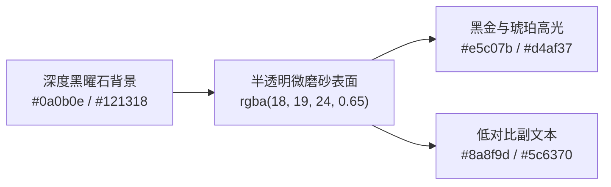

# UI/UX Pro Max: Narratium 黑金暗黑拟物与移动优先设计系统

本规范旨在将 Narratium (叙梦 Naro) 的视觉交互 1:1 还原为工业级高奢沉浸体验，杜绝低质平庸的 AI 模板化界面（No AI Slop）。

---

## 一、 核心视觉调色板 (Obsidian Gold Palette)



### 1. 颜色与材质规范
- **主背景色 (Background)**: `#090a0d`（极深纯黑曜石）配合微妙的径向暗金色弥散光晕（Radial Amber Glow）。
- **玻璃容器 (Glass Container)**:
  ```css
  background: rgba(18, 19, 24, 0.72);
  backdrop-filter: blur(16px) saturate(180%);
  -webkit-backdrop-filter: blur(16px) saturate(180%);
  border: 1px solid rgba(229, 192, 123, 0.15);
  box-shadow: 0 8px 32px 0 rgba(0, 0, 0, 0.45);
  ```
- **核心操作主色 (Primary Action)**: 琥珀金渐变 `linear-gradient(135deg, #f5d17a 0%, #d4af37 100%)`，文字使用深黑反色 `#0a0b0e`。
- **限制级/绅士标签 (NSFW Badge)**: 玫红与酒红渐变 `linear-gradient(135deg, #ff416c 0%, #8a2387 100%)`。

---

## 二、 移动优先与手势交互规范 (Mobile-First Specs)

### 1. 基础视口与安全区适配 (Safe Area)
- 视口基准：以手机屏幕 `375px ~ 430px` 为第一视口设计。
- 顶部 AppBar：`padding-top: env(safe-area-inset-top);`
- 底部 5-Tab Bar：`padding-bottom: env(safe-area-inset-bottom); height: calc(60px + env(safe-area-inset-bottom));`

### 2. 软键盘防遮挡 (Virtual Keyboard Handling)
- 在对话输入框区域，使用 `window.visualViewport` 动态监听软键盘弹起高度：
  ```ts
  /**
   * 软键盘弹起高度监听器
   */
  export function useVirtualKeyboard() {
    const keyboardHeight = ref(0)
    
    if (typeof window !== 'undefined' && window.visualViewport) {
      window.visualViewport.addEventListener('resize', () => {
        const viewport = window.visualViewport!
        const currentHeight = window.innerHeight - viewport.height
        keyboardHeight.value = Math.max(0, currentHeight)
      })
    }
    
    return { keyboardHeight }
  }
  ```

### 3. 原生级触控标准 (Touch Targets & Feedback)
- **最小触控区域**：所有按钮、图标及交互元素最小不得低于 `44px × 44px`。
- **触控反馈**：按钮点击必须配置微缩放或光效回馈（如 `active:scale-95 transition-transform duration-100`）。
- **Swipe 横向切换**：多版本对话回复支持流畅的手势左右滑动（Swipe 1/N）。
- **BottomSheet 底部抽屉**：支持下拉手势拖拽关闭与弹性回弹。

---

## 三、 绝对禁止的设计反模式 (Forbidden Slop Anti-Patterns)

1. ❌ **严禁使用平铺无质感的冷灰背景**（如 `#222222`、`#333333`）：必须使用带有环境光晕与深黑玻璃层次的 Obsidian 材质。
2. ❌ **严禁高饱和度纯白大面积文本**：主要文本使用 `#f3f4f6`，次要文本使用 `#8a8f9d`，防止暗黑模式刺眼。
3. ❌ **严禁粗暴的直角卡片**：移动端容器统一采用 `rounded-2xl`（16px）或 `rounded-3xl`（24px）圆角。
4. ❌ **严禁出现破坏视口的横向滚动条**：所有容器必须在 `375px` 窄屏下做文字截断（`truncate`）或流式折行。
